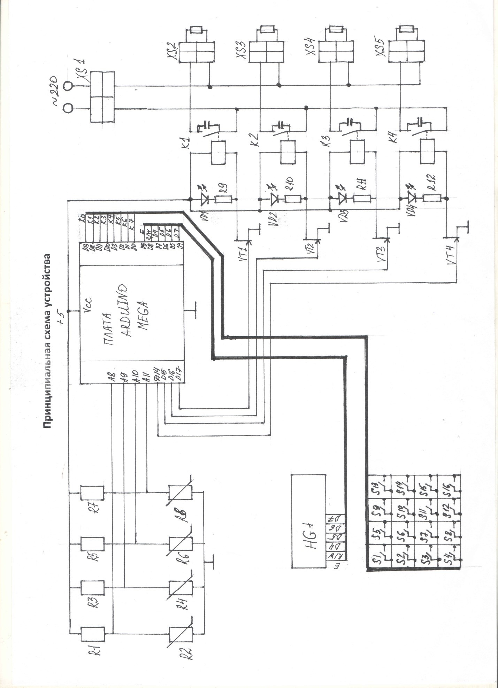

# SmartHome
this arduino sketch controls the underfloor heating, maintaining the set temperature(Used Arduino Mega)
## SETUP
1. Install the library [KeyPad](https://www.arduino.cc/reference/en/libraries/keypad/)
2. Assemble the circuit according to the blueprint:

3. Arduino GND pin and rele GND must be connected to avoid reboots
